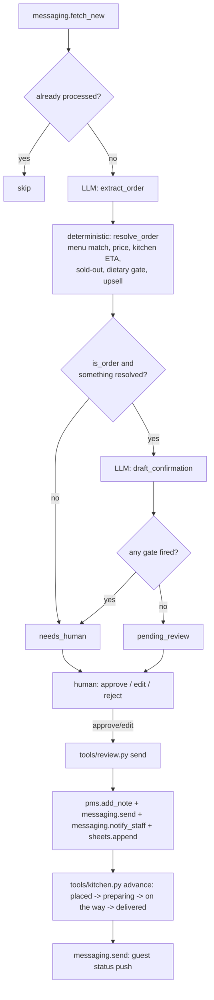

# In-Room Dining AI — "The Butler"

Takes room-service and poolside orders in any language — from the QR card on the room desk, web chat, or the Voice AI line.

## What it does

Takes room-service and poolside orders in any language — from the QR card on the room desk, web chat, or the Voice AI line. The guest orders from a branded menu on their own phone: pairings and add-ons suggested, a delivery promise up front, charge-to-room in one tap. The kitchen gets a clean ticket, and the guest watches live status from confirmed to at-your-door — with one well-timed extra offered along the way.

## What it won't do

Kitchen capacity rules cap what it promises; allergies and special requests are confirmed, never assumed.

## Why it matters

In-room dining is the highest-margin F&B channel and the most friction-heavy to order from. Removing the phone call lifts order volume.

## What to expect

Every order captured accurately with an upsell attached and the guest kept informed to the door — no phone call, no front-desk relay.

The roster text above is quoted exactly as it appears on the demo platform's
agent menu — this repo does not promise more than that, and does not
promise less. ROI figure: `+14%` In-room dining revenue (revenue). This repo
implements the "kitchen capacity" and "confirmed, never assumed" halves of
`cant` as real, working guardrails — not left as a warning label. Two things
the roster leans on that this template genuinely does not build a UI for —
the guest's own branded phone screen, and the QR card itself — are named
plainly in `docs/how-it-works.md`'s design decisions, not hidden: guest
orders come in as a text message from whatever channel your `systems.
messaging.adapter` connects, and the confirmation and status updates go back
the same way.

## Who it's for

Any hotel that takes room-service or poolside orders by phone today, or
through a portal that only speaks one language, and wants that replaced with
something a guest can order from in their own words, priced correctly every
time, with a dietary note that gets confirmed instead of guessed at.

You will get the most from this repo if:

- Your in-room dining or poolside orders already come in as text somewhere
  - WhatsApp, a web-chat widget, a QR-ordering page with its own backend -
  or you are willing to connect one; this agent needs somewhere to read a
  guest's order from (`systems.messaging.adapter`).
- You want every order priced against a real, editable menu instead of a
  script reading numbers off a laminated card, and you want an item that is
  86'd today to actually stop guests ordering it instead of a person
  catching it after the fact.
- You are comfortable a person reviews every order before it reaches the
  kitchen - this ships in shadow mode and stays there until you say
  otherwise, and even in live mode a dietary note, a sold-out item, an
  unmatched item, or an unsupported language always waits for a person
  (see "Guardrails & safety").
- You want the guest kept informed without someone at the desk manually
  texting "your food is on its way" - `tools/kitchen.py advance` does that
  for you.

It is less of a fit if you have no channel at all guests can text an order
into and are not willing to stand one up (a webhook into a simple
QR-ordering page is the fastest way to get there), or if your kitchen genuinely
cannot commit to a menu with real prices and descriptions - the whole engine
prices against `config/agent.yaml: menu:`, so an inaccurate menu means
inaccurate tickets.

## How it works

Deterministic pricing and gating; the model only ever reads free text and
writes prose - it never decides a price or a safety gate.



Full detail, the exact gates, and the ten design decisions taken where the
demo this repo was built from left a gap (no kitchen-capacity model, no
allergy field, no folio write, no guest push, one hard-coded room): see
`docs/how-it-works.md`.

### The two modes

| Mode | What happens |
|---|---|
| `shadow` (default) | Reads a guest message, extracts and prices the order, drafts the confirmation, and queues it. **Never** posts a folio note, messages a guest, or tickets the kitchen — including an order you already approved; the approval is recorded, sending waits for `mode: live`. |
| `live` | An order that is approved actually fires: folio note, guest confirmation, kitchen ticket, order-log row. Everything else still waits. |

### The review loop

Nothing reaches a guest or the kitchen without a person saying so.
`workflows/80-review.md` covers the full loop: list, show, approve, edit,
reject, send, then move the ticket through the kitchen.

### What runs when

| Workflow | Cadence | Provider used |
|---|---|---|
| `workflows/10-take-orders.md` (`tools/run.py --once`) | every 5 minutes | whatever `llm.provider` is set to |
| `workflows/80-review.md` (`tools/review.py`) | whenever a person is available | none — queue operations only |
| `tools/kitchen.py board` / `advance` | as the kitchen finishes each step | none — deterministic |

`python3 tools/schedule.py --all` prints one ready-to-paste cron/launchd/
systemd snippet per entry above, read straight from `config/agent.yaml:
schedule:` — see "Run it" below.

## What you need

| Item | Required? | Notes |
|---|---|---|
| A computer or small server that can run Python 3.11+ | Yes | Your laptop is fine to start; `workflows/90-go-live.md` covers scheduling it properly. |
| A Claude Code subscription, or your own Anthropic API key | Yes | The `interactive` provider uses the Claude Code session you already have open — zero extra cost, and you see exactly how the extraction and confirmation steps reason. |
| A channel guests can text an order into (WhatsApp, a web-chat widget, a QR-ordering page's backend) | Yes for real orders | Starts on 12 bundled fixture messages; `docs/integrations.md` covers `unipile` (WhatsApp) and `webhook` (any inbound-capable platform). |
| Your PMS, as a CSV export, an API, or nothing at all | Optional | Used only to confirm the room and post a folio note; without it the order still queues, just without a reservation id to note against. |
| A Google Sheet, or nothing at all | Optional | The order log exports to local CSV by default; a Sheet is a nicer place for a manager to skim it. |

Time estimate: 5 minutes to see the demo, half a day to fill in your real
menu and connect a channel, a few real services of watching the review
queue before you would reasonably consider going live.

## Quick start (5 minutes, no credentials)

```bash
git clone https://github.com/th1-ai/in-room-dining-ai.git in-room-dining-ai
cd in-room-dining-ai
make setup
make demo
```

You should see something like this:

```
In-Room Dining AI demo - 12 sample guest message(s) from fixtures/inbound/messages.json

  order-01: Room 204 -> EUR 42, ETA 35min, status=pending_review
  order-02: Room 210 -> EUR 48, ETA 35min, status=pending_review
  order-03: Room 118 -> EUR 40, ETA 35min, status=needs_human [dietary_signal:named:gluten]
  order-04: Room 227 -> EUR 30, ETA 35min, status=needs_human [dietary_signal:ambiguous]
  order-05: Room 322 -> EUR 24, ETA 35min, status=needs_human [dietary_signal:named:nut]
  order-06: Room 101 -> not an order, status=needs_human
  order-07: Room 233 -> not an order, status=needs_human
  order-08: Room 305 -> not an order, status=needs_human
  order-09: Poolside, sunbed 6 -> EUR 46, ETA 35min, status=needs_human [dietary_signal:named:dairy]
  order-10: Room 108 -> EUR 14, ETA 35min, status=needs_human [language_unsupported:sv]
  order-11: Room 214 -> EUR 78, ETA 35min, status=pending_review
  order-12: Room 341 -> EUR 30, ETA 35min, status=needs_human [dietary_signal:named:gluten]

9 of 12 need a person to look first (a sold-out item, an unmatched item, any dietary note, an unsupported language, or a message that was not an order at all - see docs/safety.md).
Nothing was sent: mode is shadow, and demo never calls send() at all.
Next: `make review` to see the queue, or read workflows/10-take-orders.md.

DEMO OK — 12 items processed, 12 drafted, 0 sent (shadow)
```

Every number above comes from an invented property, "Hotel Aurora," and 12
fabricated guest messages designed to exercise the interesting paths in one
run — a clean order, a quantity suffix, a named allergen in French, German,
Italian and Portuguese, an ambiguous allergy mention in Spanish, a sold-out
item, an item nothing on the menu matches, a message that is not an order
at all, a poolside location, and a guest language this hotel does not
configure (Swedish) — so you can see exactly how this agent thinks before it
ever touches a real guest. Next: open `claude` in this folder and follow
"Set up with Claude Code" below.

Then `make doctor` — expect one `FAIL` (`hotel identity`, because the
property is still the shipped placeholder "Hotel Aurora") and a couple of
`warn` lines. That is the intended state of a fresh clone; see
`workflows/00-setup.md` for filling in the real property and menu.

## Set up with Claude Code

Open `claude` in this folder. Paste each prompt below in order — Claude will
follow the named workflow file, which tells it exactly which tools to run
and what to check.

**Phase 1 — first run.**

> Read `workflows/00-setup.md` and walk me through it. I have not run this
> agent before.

**Phase 2 — take some orders.**

> Read `workflows/10-take-orders.md`. Run one pass and show me what the
> agent did, in plain language.

**Phase 3 — the review queue.**

> Read `workflows/80-review.md`. Show me what is waiting for me, one at a
> time, and act on my decisions.

**Phase 4 — going live.**

> Read `workflows/90-go-live.md`. Go through the checklist with me honestly
> — do not recommend going live until it is genuinely true.

You can also just run the agent directly — `/in-room-dining-ai` in this
folder runs the main loop and works the queue in one command; see
`.claude/skills/in-room-dining-ai/SKILL.md`.

## Connect your systems

Full detail, including the "implement your own" recipe, is in
`docs/integrations.md`. This agent uses three of the four shared adapters —
**PMS**, **Messaging** and **Sheets** — and does not use **Email** at all
(there is no guest inbox and nothing to sign).

### PMS - `systems.pms.adapter` in `config/hotel.yaml`

| Adapter | Status | Needs |
|---|---|---|
| `mock` | universal | nothing — fixture reservations keyed by room number, what `make demo` uses |
| `csv` | universal | `data/imports/reservations.csv` — **start here**, works with any PMS |
| `cloudbeds` | built | `CLOUDBEDS_CLIENT_ID`, `CLOUDBEDS_CLIENT_SECRET`, `CLOUDBEDS_REFRESH_TOKEN`, `CLOUDBEDS_PROPERTY_ID` |
| `cli` | universal | a JSON-speaking CLI for your PMS |

Used to confirm the room and post the folio note (`add_note()` — the only
PMS write; there is no folio-charge API in this family, see
`docs/how-it-works.md` "Design decisions" #4).

### Messaging - `systems.messaging.adapter` in `config/hotel.yaml`

| Adapter | Status | Needs |
|---|---|---|
| `mock` | universal | nothing — reads `fixtures/inbound/messages.json`, what `make demo` uses |
| `unipile` | built | `UNIPILE_DSN`, `UNIPILE_API_KEY`, `UNIPILE_ACCOUNT_ID`, `UNIPILE_STAFF_CHAT_ID` — WhatsApp on your own number |
| `webhook` | universal | `MESSAGING_WEBHOOK_URL` — POST to Zapier, Make, n8n, or your own endpoint |

This is the whole guest-facing surface: `fetch_new()` is the order coming
in, `send()` is the confirmation and every later status push, and
`notify_staff()` is the kitchen ticket.

### Sheets - `systems.sheets.adapter` in `config/hotel.yaml`

| Adapter | Status | Needs |
|---|---|---|
| `csv` | universal | nothing — writes `data/exports/orders.csv` |
| `google` | built | `GOOGLE_SHEET_ID`, `GOOGLE_SERVICE_ACCOUNT_FILE` — a live shared spreadsheet |

One row per fired ticket — ref, room, guest, items, total, currency, and
which gates fired before a human approved it.

### Email - shipped, unused by this agent

Every repo in this family shares the same `core/adapters` registry, so
`make doctor` always pings an email adapter even when an agent has no use
for one. Nothing in this repo calls `core.adapters.get_email()`.

Check what is actually working on your machine at any time:

```bash
make doctor
```

## Run it

```bash
make run                              # one pass over new guest messages
make run ARGS="--limit 5"             # just the first five
make run ARGS="--dry-run"             # compute and price, write nothing
make watch                            # keep running on the configured interval
make run ARGS="--set-rule upsell=off" # toggle the live upsell rule, then exit
make review                           # what is waiting for a person
python3 tools/kitchen.py board        # what has fired, and where it is
python3 tools/kitchen.py advance <ref> # move one ticket forward
make report                           # what the agent did, and what it cost
```

**Scheduling.** The one recurring job lives in `config/agent.yaml:
schedule:` (`take_orders`, every 5 minutes — orders are time-sensitive):

```bash
python3 tools/schedule.py --all
```

prints a ready-to-paste cron/launchd/systemd snippet, read straight from
that block. `scheduler/crontab.example`, `scheduler/launchd.example.plist`,
`scheduler/systemd.example.service` and `scheduler/systemd.example.timer`
have the generic single-job form if you would rather hand-edit.

**Subscription or API.** `llm.provider: interactive` or `claude-code` runs
on the Claude Code subscription you already pay for — genuinely the
cheapest way to run this agent, with the caveat that Anthropic's usage
policy governs automated use of a personal subscription (a handful of
orders an hour is normal; a full dinner service hammering it around the
clock is closer to the edge). `llm.provider: anthropic` uses your own API
key, bills per token, and is the right choice for a property doing real
volume — two calls per order (`extract_order`, `draft_confirmation`),
`--dry-run` uses only the first. `make report` shows what you are actually
spending. See `docs/safety.md` for the full honest note.

## Go live

Shadow mode is the default and stays the default until you change it. The
full checklist — real menu filled in, dietary policy agreed with the
kitchen, a real channel connected, a few real services of review behind
you, the shadow backlog cleared — is in `workflows/90-go-live.md`. In
short:

```yaml
# config/hotel.yaml
mode: live
```

Going live means an **approved** order now actually posts the folio note,
messages the guest and tickets the kitchen — it does not change what needs
approval, and it never makes the dietary/sold-out/unmatched-item/language
gates optional (see "Guardrails & safety"). `review.require_approval_for`
still lists `send_message` and `pms_write` by default, so every order still
waits for a person. Before flipping the switch, clear the backlog that
built up in shadow mode — it may be priced against an old menu:

```bash
python3 tools/review.py stale
```

Going back to shadow (`mode: shadow`, or `AGENT_MODE=shadow` in `.env` for
one run) stops every send immediately, mid-schedule, with no other change
required.

## Guardrails & safety

Full detail in `docs/safety.md`. The short version:

**What it will not do.**

- Fire a ticket while `mode: shadow` — including an order you already
  approved.
- Guess at a menu item it cannot match, or quietly substitute a sold-out
  item for another.
- Assume a dietary or allergy note is safe to ignore, whatever language it
  is in — a note is never simply dropped. It is tagged with the specific
  allergen family (nut, gluten, dairy, shellfish, egg, soy) in eight
  languages, accent-folded (English, Spanish, French, German, Italian,
  Portuguese, Greek, Dutch); any other language still always escalates,
  just without that family tag — see "Adding a language" below.
- Take a payment, issue a refund, or move money — there is no payments
  adapter call anywhere in this repo.
- Quote a made-up upsell statistic — a real attach-rate percentage only
  appears once enough completed orders exist to compute one.
- Cancel or edit a fired order — that always needs a person.

**What always needs a human**, enforced in code (the `resolve_order`
function in `tools/menu_engine.py`), not just in the prompt:

- A dietary or allergy note of any kind, named or ambiguous, whatever
  language it is written in.
- A requested item that is sold out today.
- An item the extraction step could not match to the real menu.
- A guest language `hotel.languages` does not include.
- Low extraction confidence.
- A message that was not placing an order at all.

**Telling guests they are talking to AI.** The EU AI Act (Article 50)
expects a person to know when they are talking to an AI system. This ships
wired in, not left for you to add: `draft()` in `tools/engine.py` appends the
disclosure line to every guest confirmation before it ever reaches the
review queue, using `knowledge/disclosure.md` once you have filled it in,
or a shipped generic English line until then — so a confirmation is never
sent without one. `make doctor` (`disclosure line`) tells you which one is
active. Full detail, how to put it in your own language, and why this is
the same call every messaging adapter's own `send()` makes: `docs/safety.md`.

**Data handling.** Everything lives in `data/agent.db` on your own machine
— there is no cloud service behind this repo. The sensitive data here is
dietary/allergy notes and guest phone numbers, not payment cards; keep
`data/agent.db` off a shared machine and set `privacy.retention_days` to
something short.

## Customising

**`config/agent.yaml`.** The menu (`menu:` — slug, name, category, price,
description), the kitchen numbers (`kitchen:` — tray charge, base ETA,
capacity, sold-out list), the upsell target (`upsell:`),
`confidence_threshold`, `review.require_approval_for`, and `schedule:`.

**Toggling the upsell day to day.** Edit `upsell.enabled` to change the
*seed* state for a fresh database; to change the *live* state, use
`tools/run.py --set-rule upsell=on|off`.

**`knowledge/dietary-policy.md`.** Shapes the kitchen ticket's dietary line
- your house rule for handling a flagged allergy, and cross-contamination
notes for the kitchen. See `knowledge/README.md`.

**`prompts/extract_order.md` and `prompts/draft_confirmation.md`** are
plain markdown with `{{var}}` placeholders — edit them to change how the
agent reads a message or how the confirmation reads. Neither can change a
price, an ETA, or whether an order needs a person — those stay in
`tools/menu_engine.py`.

**Adding a language.** Add the code to `hotel.languages` in
`config/hotel.yaml`. `extract_order` already detects any language it can
read; the gate is only about which languages this hotel has agreed to
reply in. **List order matters**: the first entry is
`settings.hotel.default_language` (`core/config.py`) — the language every
reply falls back to when a guest writes in something `hotel.languages`
does not include (`resolve_order()` in `tools/menu_engine.py`, `docs/safety.md`
"Reply only in the hotel's languages"). Put whichever language most of
your international guests would actually read first, not necessarily your
own working language — with `languages: [el, en]`, a French or Swedish
guest gets a Greek-only reply, never English, unless English is listed
first.

**Named-allergen coverage by language.** `tools/menu_engine.py`'s
`detect_dietary()` tags a dietary note with the specific allergen family
(nut, gluten, dairy, shellfish, egg, soy) in eight languages: English,
Spanish, French, German, Italian, Portuguese, Greek (`el`) and Dutch
(`nl`) — the `_ALLERGEN_STEMS` dict names them. Adding any other language
to `hotel.languages` does not add allergen-family coverage for it: a note
in that language still always escalates (`detect_dietary()` never returns
"none" for a non-empty note) but only as the generic
`dietary_signal:noted`, never silently dropped, and never silently
mislabelled — a reviewer opens the item and reads the note themselves. If
your property serves a ninth language often enough that losing the
allergen-family tag matters, add stems to `_ALLERGEN_STEMS` /
`_ALLERGY_SIGNAL_STEMS` following the existing pattern (accent-folded,
substring match against `_fold()`'s output — see the comment above them
for the Greek final-sigma note) and extend `tests/test_menu_engine.py`.

**Adding poolside locations, or another venue.** Nothing to configure —
`location` is free text on the inbound message itself
(`fixtures/inbound/messages.json` has an example); it shows up wherever the
room number otherwise would.

## Troubleshooting & FAQ

Full list: `workflows/99-troubleshooting.md`. The most common ones:

**`make run` exits with code 3.** Not an error —
`llm.provider: interactive` parked a prompt. Answer it in `data/pending/`
and re-run; this can happen once for extraction and again for the
confirmation, and a retry never re-extracts a message it already parsed.

**An order always shows up `needs_human` and I don't know why.**
`python3 tools/review.py show <id>` lists the exact gates in
`gates` — machine-readable, one entry per reason.

**"Why didn't my menu edit show up in an order I already approved?"** It
won't — a re-run always re-extracts and re-prices a new message from
scratch; an order already in the queue is untouched. Edit the menu, then
watch the next order use it.

**"Can the agent ever fire a ticket automatically?"** Not for anything with
a gate against it — not in this template, by design (see "Guardrails &
safety"). `mode: live` changes whether an *approved* order sends; it never
removes the review step, and the six safety gates cannot be turned off.

## Measuring the benefit

```bash
make report
```

Tracks orders fired vs. waiting for a person, revenue and average order
value in your own currency, the real upsell attach rate, why orders needed
a person (by gate), and LLM spend (two calls per order). Full detail, what
each number means, and the honest gaps between the roster promise and what
this repo actually measures (kitchen capacity is a formula not a live feed,
the ticket is simulated, "charge to room" posts a note not a charge, no
cancellation path): `docs/benefits.md`.

## About

Built by [TH1](https://th1.ai) as part of a family of open-source hotel
AI-agent templates. Licence: MIT (`LICENSE`). Want it run for you, tuned to
your own menu and kitchen, instead of running it yourself? [th1.ai](https://th1.ai).

**Changelog.** v1 — initial release: order extraction in any language,
deterministic menu pricing and matching, kitchen-capacity-aware ETAs, a
sold-out gate, eight-language dietary/allergen detection (with a
never-silent generic fallback for any other language), a wired-in EU AI Act
disclosure line, the rule-gated upsell with a real (never invented) attach
rate, the folio-note charge, the review queue, and guest status pushes
through delivery.
