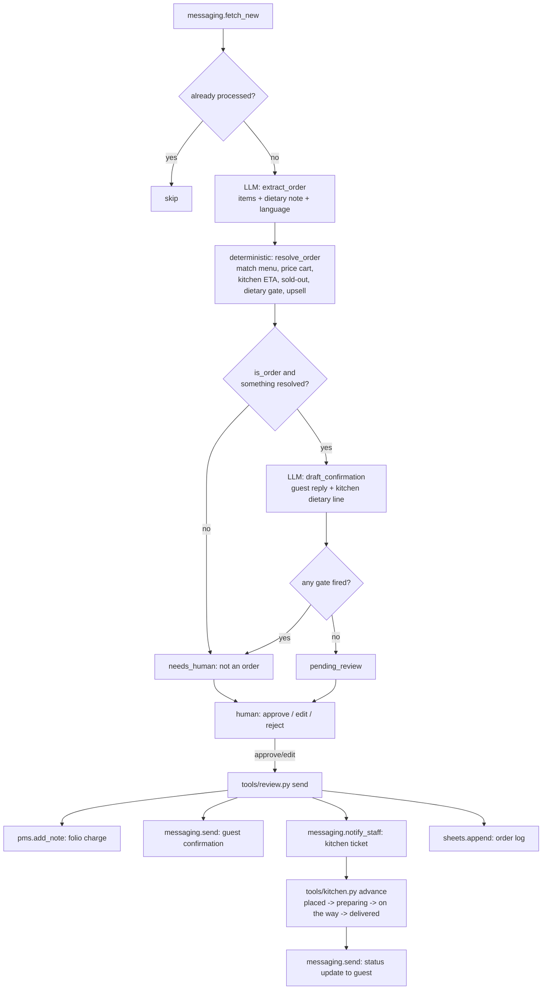

# How In-Room Dining AI works

"The Butler" takes room-service and poolside orders from a guest's own free-text
message (WhatsApp, web chat, or the transcript handed to it by the Voice AI
line), turns them into a priced, kitchen-ready ticket, and keeps a human between
every ticket and the kitchen until you trust it.

## The loop, step by step

Two model calls per order, both through `core/llm.py`, both with a JSON schema:

1. **`extract_order`** — reads the guest's free-text message and returns the
   items it thinks were ordered, any dietary/allergy text verbatim, and the
   language the guest wrote in. It never decides whether the order is safe to
   send; it only reads language.
2. **`draft_confirmation`** — once the order is priced and gated, writes the
   guest-facing confirmation in the guest's own language and a short
   English line for the kitchen ticket summarising any dietary note.

Everything else — matching an item to the menu, pricing the cart, the kitchen's
ETA, whether an item is sold out, whether a dietary note needs a person, whether
to offer the upsell — is plain Python in `tools/menu_engine.py`. No model ever
decides money or safety. That module has no I/O: feed it the same menu, cart and
kitchen state and it returns the same answer every time, and every number in the
result traces back to a row you gave it (ARCHITECTURE.md section 1).

## What runs when

| Workflow | Cadence | Provider |
|---|---|---|
| `tools/run.py --once` (take orders) | every 5 minutes | your configured `llm.provider` |
| `tools/kitchen.py advance` | on demand, from the kitchen or the review queue | none (deterministic) |
| `tools/report.py` | on demand | none |

`config/agent.yaml: schedule:` is the source of truth; `make schedule ARGS="--all"`
prints the exact snippet for this machine (README section 9).

## The two modes

`shadow` (default): the agent reads guest messages, extracts the order, prices
it, drafts the confirmation, and queues it. It never posts to your PMS, never
messages a guest and never notifies the kitchen. `live`: an **approved** item's
three writes (folio note, guest confirmation, kitchen ticket) really happen.
Everything else still waits. See `docs/safety.md`.

## Data model

One `items` row per inbound guest message (`kind: "order"`, `source:
"messaging"`, keyed on `(source, external_id)` so a re-fetched message is never
processed twice). The payload carries the raw message plus two cached stages:

- `_extract_cache` — the raw `extract_order` answer (survives a payload
  refresh: `upsert_item` preserves any `_`-prefixed key).
- `_resolved` — the deterministic `resolve_order()` output: matched lines,
  unmatched items, sold-out items, dietary gates, kitchen ETA, upsell decision,
  totals. This is what `draft_confirmation` reads, what the reviewer sees in
  `tools/review.py show`, and what the kitchen ticket is built from — never
  re-derived from the raw LLM answer a second time.
- `_status` — set to `"placed"` the moment the ticket actually fires (the
  `send` step of `tools/review.py`), then advanced by `tools/kitchen.py` through
  `preparing`, `on the way`, `delivered`. Absent before the ticket fires: a
  drafted-but-not-yet-sent order has no kitchen status, because the kitchen has
  not seen it yet.
- `_order_ref` — minted with `store.next_sequence("order_ref")` only once the
  order is queued (both LLM stages have already succeeded). See
  "Idempotency" below for why.

## Idempotency

- **Row dedup.** `(source="messaging", external_id=message.id)` is unique
  (`store.upsert_item`); a re-fetched message is a no-op.
- **Resumable stages.** An item with `_extract_cache` but no draft was
  interrupted after extraction (an `interactive` pend on the draft call, a
  crash). The next pass resumes at `draft_confirmation`, not `extract_order` —
  `tools/engine.py:process_order` checks `item.intent and item.draft is not
  None` first, then checks the cache before re-running either stage, mirroring
  the trap documented in `factory/workflows/build-repo.md` ("Resumable
  stages").
- **The order reference is minted last, on purpose.** `_order_ref` (`RS-0001`
  style, `store.next_sequence("order_ref")`) is only assigned once both LLM
  stages have finished and the item is about to be queued for review — never
  before. If it were minted at ingestion and the draft call then pended on the
  `interactive` provider, a retry that resumed at the draft stage would still
  be "the same order," but a naive mint-early design would already have
  reserved a reference number nobody could see yet. Minting after both stages
  resolve means one guest message is always exactly one reference number, and a
  dry run never burns one (`next_sequence(..., dry_run=...)`).
- **The kitchen ticket only fires once.** `tools/review.py send` claims
  `approved`/`edited` rows atomically before doing the three writes
  (`store.claim_for_send`), so two runners racing on the same queue cannot both
  fire the same ticket.
- **Status advances are one-way and idempotent.** `tools/kitchen.py advance`
  only accepts an item whose `review_status` is `sent`/`auto_sent` (the ticket
  really fired) and whose `_status` is not already `delivered`; calling it
  again on a delivered order is a no-op with a clear message, not an error.

## Design decisions (the spec was silent or the demo was incomplete)

The behavioural spec (`specs/in-room-dining-ai.md`) is extracted from a demo
that was deliberately UI-only: a hard-coded menu, one hard-coded room, no
capacity model, no allergy field, no folio write, and no push to the guest
(`specs/in-room-dining-ai.md` section 11, "Open questions for the template
author"). This repo is a real, deployable agent, so it had to make calls the
demo never needed to:

1. **The menu moved from code to config.** The demo's 12 items were a
   TypeScript constant; here they live in `config/agent.yaml: menu:`, a plain
   list a hotel edits without touching Python (spec open question #8). The
   deterministic engine is still the only thing that trusts prices — the model
   proposes a slug, the engine looks it up against the real menu, and a slug it
   invented is treated as unmatched, never priced on trust.
2. **Kitchen capacity is implemented, not a constant.** The spec's `cant`
   ("kitchen capacity rules cap what it promises") had no implementation in the
   demo — the 35-minute ETA was shown to every guest regardless of load (open
   question #1). Here, `config/agent.yaml: kitchen.capacity_before_delay` and
   `delay_step_minutes` grow the quoted ETA once more than N tickets are
   currently `placed`/`preparing` (capped at `max_eta_minutes`), and
   `kitchen.sold_out` is a plain list of menu slugs the kitchen has pulled for
   the day — a hotel edits it each morning, or wires their own feed later.
   Requesting a sold-out item always escalates rather than silently
   substituting something.
3. **Allergies and special requests are confirmed, never assumed — for real.**
   The other half of the `cant` (open question #2) had no field in the demo at
   all. Here, every dietary/allergy signal in the guest's message — named
   (nut, gluten, dairy/lactose, shellfish, egg, soy) or merely ambiguous (the
   note names *some* allergy this repo has no keyword for) — is a hard,
   non-configurable `needs_human` gate, whatever language it is written in.
   The named-allergen family is identified in eight languages
   (`en es fr de it pt el nl`) with accent folding, the same safety pattern
   used by Table / Floor Management AI's `has_allergy_signal`; any other
   language still always escalates (the generic `dietary_signal:noted` —
   see `docs/safety.md`), never silently. There is no autonomy setting that
   skips any of this.
4. **A folio note stands in for "charge to room."** The demo's "Charged to
   Suite 1204" was copy; nothing posted anywhere (open question #3). No PMS
   interface in this family exposes a real folio-charge write, so this repo
   posts an itemised note to the guest's reservation with `pms.add_note()` —
   honest about what it is (a note a front desk can turn into a real charge),
   not a claim that money moved. If your PMS has a real folio-charge API,
   write your own adapter method following `docs/integrations.md#implement-your-own`.
5. **The kitchen ticket is still simulated, on purpose — but status pushes to
   the guest now.** There is no universal KDS/printer protocol to build
   against, so `messaging.notify_staff()` is the ticket (open question #4): it
   reaches the kitchen however your `systems.messaging.adapter` delivers a
   staff message (WhatsApp group, Slack via webhook, a printer bridge you
   wire up). What the demo could not do — "no push to the guest" (open
   question #12) — this repo does: `tools/kitchen.py advance` sends the guest
   a status update at every step, since the whole point of a WhatsApp-native
   agent is that the guest does not have to keep a screen open. The order
   item's own `review_status` is permanently `sent` by the time a status push
   happens (that is what "the ticket fired" means), and the write guard reads
   `review_status: sent` on an item as "this exact message already went out,
   refuse the duplicate" - the right question for a resend, the wrong one for
   a *later, different* status line. `tools/kitchen.py` passes the guard a
   throwaway, never-persisted stand-in item (`review_status="approved"`) for
   this call only; nothing about the real order's row or its audit trail
   changes, and `mode: shadow` still blocks the push either way (moot in
   practice, since a ticket can only reach `sent` in live mode to begin
   with).
6. **One room number per order, not a hard-coded suite.** The demo's
   `IRD_ROOM = "1204"` is gone (open question #5): every inbound message
   carries its own `room_number` (and an optional `location` label — "Poolside,
   sunbed 6" — for the promised poolside channel, open question #11). The room
   number is also the fixture PMS's reservation id (`fixtures/hotel/
   reservations.json`), so identity resolution never depends on the current
   wall-clock date; a real PMS resolves it via `pms.list_in_house(today)`
   filtered to `room_id == room_number` instead (see `tools/menu_engine.py`
   `resolve_room` and `docs/integrations.md`).
7. **"Any language" is now real.** The demo's portal was English-only (open
   question #7). `extract_order` detects the guest's language and
   `draft_confirmation` replies in it — but only when that language is in
   `hotel.languages`; otherwise the reply is drafted in
   `settings.hotel.default_language` (`core/config.py` — the first entry of
   `hotel.languages`, wherever it is read in this repo) and the item is
   `needs_human`, exactly the family-wide rule (see
   `factory/workflows/build-repo.md`, "Reply only in the hotel's languages").
   List order is a real decision, not an afterthought: put whichever
   language most of a hotel's international guests would actually read
   first — see README "Adding a language". "Web chat" is covered the same
   way `messaging.adapter: webhook` covers any text channel; nothing here is
   voice-specific, so the Voice AI line's own transcript can be handed to
   the same intake.
8. **The upsell no longer quotes an invented statistic.** The demo's fondant
   card said "68% attach rate on suites" — a number nothing computed (open
   question #9). `tools/report.py` computes the real attach rate from your own
   `data/agent.db`, and the confirmation only quotes it once
   `upsell.min_orders_for_stat` completed orders exist; before that it says
   "a popular pairing," not a made-up figure. The dedup rule is the demo's own
   `cartHasDessert`: an order that already has a dessert-category item is
   never offered another.
9. **A rule toggle, not a config edit, for the upsell.** Matching the demo's
   "provable toggle," `upsell.enabled` in `config/agent.yaml` is a seed value;
   the live value lives in `data/agent.db` and is changed with
   `tools/run.py --set-rule upsell=on|off`, exactly like Table / Floor
   Management AI's `dining_rules`. `kitchen.sold_out` and the capacity numbers
   stay plain config, because nothing in the spec asked for those to be
   toggled live.
10. **No cancellation or edit — still true here, still flagged.** Once a
    ticket fires it can only move forward through the status flow (open
    question #10). A guest who wants to change or cancel an order needs a
    person; there is no `tools/review.py cancel`. This is a gap worth closing
    if you build on this repo, not a promise the roster makes.
11. **A message that is not an order gets a person, not a guess.** "What time
    does room service stop?" is not something `extract_order` should invent an
    answer to. When `is_order` is false, the item skips straight to
    `needs_human` with no cart to resolve — a person replies directly rather
    than the agent answering questions the spec never gave it a knowledge base
    for.

## Nothing fires a ticket without a person

Whatever `mode` and `autonomy` are set to, an order reaches the kitchen only
after a human calls `approve` or `edit` in the review queue — `autonomy: draft`
is the shipped default and the README does not walk through changing it. The
three writes on `send` (`pms_write`, `send_message` twice — guest and staff) are
all in `review.require_approval_for` by default, and the six safety gates in
"Design decisions" #3 above cannot be bypassed by any config value. See
`docs/safety.md` for the full list of what always needs a human.
